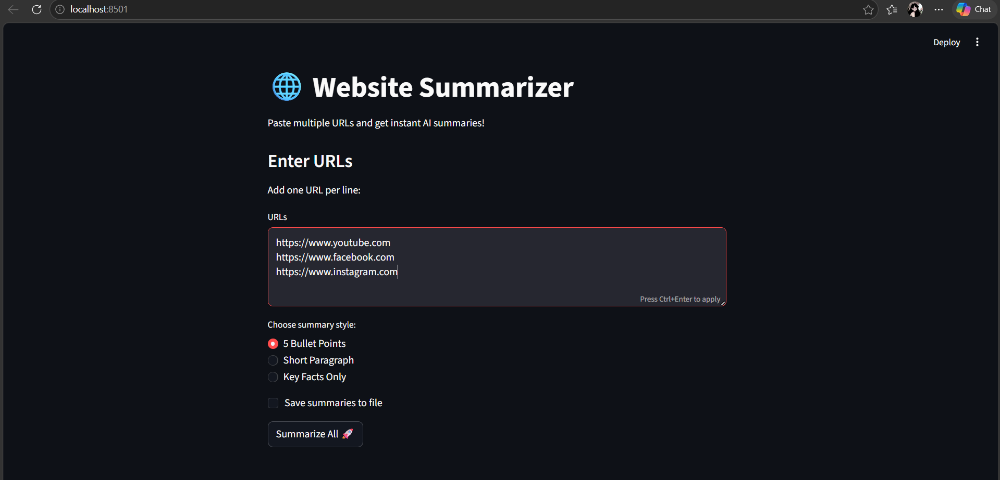

# 🌐 Website Summarizer

An AI-powered tool that scrapes any website and summarizes it using a local LLM — built entirely with free and open-source tools.

---

## 📸 Demo


---

## ✨ Features
- 🔗 Summarize single or multiple URLs at once
- 🎯 Choose summary style — bullet points, paragraph, or key facts
- 💾 Save all summaries to a text file
- 🖥️ Clean web UI built with Streamlit
- 🤖 Runs 100% locally — no API key, no cost, no internet needed after setup

---

## 🛠️ Tech Stack
- **Python** — core language
- **BeautifulSoup4** — web scraping
- **Ollama + TinyLlama** — local AI summarization
- **Streamlit** — web interface
- **Jupyter Notebook** — prototyping

---

## 💡 How It Works
1. User enters one or multiple URLs
2. BeautifulSoup scrapes and cleans the webpage text
3. Text is sent to TinyLlama running locally via Ollama
4. Clean summary is displayed in the browser

---

## 🚀 How To Run

**1. Clone the repo**
```bash
git clone https://github.com/divyamk521/website-summarizer.git
cd website-summarizer
```

**2. Create virtual environment**
```bash
python -m venv venv
venv\Scripts\activate
```

**3. Install dependencies**
```bash
pip install -r requirements.txt
```

**4. Install Ollama and pull the model**
- Download Ollama from [ollama.com](https://ollama.com)
```bash
ollama pull tinyllama
```

**5. Run the app**
```bash
streamlit run app.py
```

---

## ⚠️ Limitations
- JavaScript-heavy sites like YouTube or Instagram won't work
- Works best with Wikipedia, blogs, and news articles

---

## 📁 Project Structure
website-summarizer/
├── venv/
├── app.py                 # Streamlit web app
├── summarizer.ipynb       # original notebook
├── summaries.txt          # saved summaries output
├── requirements.txt
└── README.md

---

## 🙋‍♀️ Author
**Divya** — [GitHub](https://github.com/divyamk521)

> 🌱First project in my AI/ML learning journey